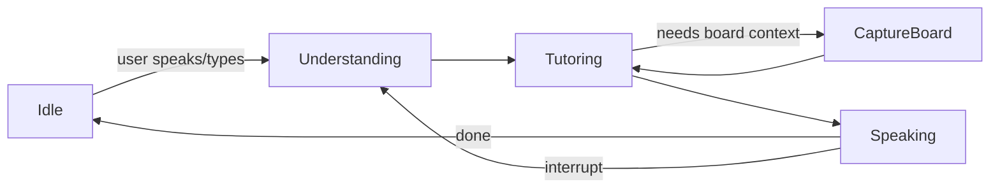

# AI Tutoring Whiteboard — Multimodal Learning Platform

A smart whiteboard that **listens**, **sees**, and **teaches**. Students can draw naturally, talk to the tutor with their voice or text, and get real-time, pedagogically sound guidance—just like a human TA looking over their shoulder.


---

## ✨ Inspiration

Most online tutoring tools split visual work (whiteboard/screen share) from the conversation (chat/voice). Math and diagram-heavy subjects need both **at once**. This project merges them into a single flow so the AI can “see” the board, listen to the student, and respond with voice, text, and drawings.

---

## 🚀 What We Built

- **🖊️ Interactive Whiteboard** — HTML5 Canvas with pencil, eraser, color & line width, optional background image (e.g., problem photo).
- **🎤 Voice Access** — Ask questions hands-free (Web Speech API).
- **👁️ Vision on the Board** — The AI analyzes the current canvas snapshot.
- **🧠 AI Tutoring** — Customizable “pushiness” levels (1–5) to fit student preference.
- **🔊 Natural Voice Responses** — ElevenLabs text-to-speech.
- **🧩 Visual Aids** — (Optional) Runware-generated visual helpers.

---

## 🧱 Technical Stack

**Frontend**
- React + TypeScript (Vite)
- Tailwind CSS
- Canvas API (drawing)
- Web Speech API (voice input)

**AI Services**
- **Google Gemini 2.0 Flash** (tutoring dialogue + image analysis)
- **ElevenLabs** (TTS)
- **Runware** (visual aids, optional)

**Data / Auth**
- **Bolt Database** (user auth, RLS policies for multi-tenant safety)

---

## 🧭 Architecture Overview

```text
Browser (React + Canvas)
 ├─ Whiteboard (Canvas API)
 ├─ Voice Input (Web Speech API)
 ├─ UI (pushiness control, status messages)
 └─ TTS Playback (audio element)

Services (client → cloud APIs)
 ├─ Gemini 2.0 Flash: NL tutoring + vision on board snapshot
 ├─ ElevenLabs: TTS (natural voice)
 └─ Runware: visual aids (optional)

Bolt Database
 ├─ Auth
 └─ RLS-protected user data
```

**Control Flow**
1. Student draws or uploads a problem → app can capture a **composited image** of the board.  
2. Student asks a question (voice or text).  
3. App sends **question + board image** to Gemini; receives guidance.  
4. If voice is enabled, the response is sent to ElevenLabs and played back.  
5. Tutor guidance is shown as text and can suggest actions on the board.

---

## 🧑‍🏫 AI Tutoring Model

**Pushiness Levels (1–5)**  
| Level | Description |
|------:|-------------|
| 1 | Minimal intervention; Socratic questions; lets students struggle productively |
| 3 | Balanced hints and checkpoints; nudges when off-track |
| 5 | Highly supportive; step-by-step guidance and corrections |

The tutor maintains recent conversation history to stay contextual, adapt tone, and avoid repeating hints.

---

## 🧪 Board → Image (Vision Input)

Capturing a clean image for Gemini was the trickiest part: multiple layers, responsive scaling, device pixel ratios. We use a **composite canvas** approach:

```ts
function captureScreenshot({
  drawCanvas,          // the drawing layer (transparent)
  backgroundImg,       // optional background image element
  width, height,       // logical board size
  devicePixelRatio = window.devicePixelRatio || 1
}): string {
  const composite = document.createElement('canvas');
  composite.width = Math.floor(width * devicePixelRatio);
  composite.height = Math.floor(height * devicePixelRatio);

  const ctx = composite.getContext('2d')!;
  ctx.scale(devicePixelRatio, devicePixelRatio);

  // White background to avoid transparent PNG analysis issues
  ctx.fillStyle = 'white';
  ctx.fillRect(0, 0, width, height);

  if (backgroundImg) {
    ctx.drawImage(backgroundImg, 0, 0, width, height);
  }
  ctx.drawImage(drawCanvas, 0, 0, width, height);

  // Base64 PNG for Gemini
  return composite.toDataURL('image/png');
}
```

Key details:
- Use `getBoundingClientRect()` + DPR scaling to keep strokes crisp.
- Always composite onto **opaque white** (many vision models assume non-transparent backgrounds).

---

## 🧰 Service Orchestration

Three distinct APIs with different auth, rate limits, and latencies:

- **GeminiService** — wraps prompt + (image) inputs, returns streamed or single-shot text.
- **ElevenLabsService** — converts text to speech; fallback to text if missing credentials.
- **RunwareService** — (optional) generates diagrams/visual helpers.

Resilience patterns:
- **Graceful degradation:** if any key is missing, log a warning and continue without that feature.
- **State machine guards:** prevent overlapping requests, ensure mic is off during TTS to avoid feedback loops.
- **Try/catch isolation:** one service failure shouldn’t crash the whole flow.

Example sequence:

```ts
const img = captureScreenshot(...);
const response = await aiTutor.getResponse(userMessage, img); // Gemini

setAiResponse(response); // text UI

if (voiceEnabled && elevenLabs) {
  await elevenLabs.speak(response, voiceId);
} // else just show text
```

---

## 🧠 Interaction State Machine (simplified)



Guards:
- `isProcessing` blocks re-entry during async requests.
- Interruptions (new voice/text) cancel TTS and resume Understanding.
- Pushiness level conditions how much detail the model reveals.

---

## 📦 Project Structure (example)

```
/src
  /components
    WhiteboardCanvas.tsx
    VoiceControls.tsx
    TutorPanel.tsx
  /services
    AITutorService.ts
    GeminiService.ts
    ElevenLabsService.ts
    RunwareService.ts
  /pages
    WhiteboardPage.tsx
    SettingsPage.tsx
  /lib
    captureScreenshot.ts
    audio.ts
    state.ts
```

---

## ⚙️ Configuration

Create `.env` (Vite requires variables to start with `VITE_`):

```bash
VITE_GEMINI_API_KEY=...
VITE_ELEVENLABS_API_KEY=...
VITE_RUNWARE_API_KEY=...

# Bolt Database (example; adapt to your provider)
VITE_BOLT_DB_URL=...
VITE_BOLT_DB_ANON_KEY=...
```

> If an API key is missing, the app will continue with a logged warning and disable that feature (e.g., no TTS without `VITE_ELEVENLABS_API_KEY`).

---

## 🏁 Quickstart

```bash
# 1) Install deps
pnpm install   # or npm install / yarn

# 2) Add your .env
cp .env.example .env  # then fill in keys

# 3) Run dev server
pnpm dev       # or npm run dev

# 4) Open the app
# Vite will print a local URL (e.g., http://localhost:5173)
```

**Build & Preview**

```bash
pnpm build
pnpm preview
```

---

## 🧩 Usage

1. **Log in** (Bolt Database auth).
2. **Load or draw** your problem on the whiteboard (optional: upload a background image).
3. **Ask** via **voice** (mic button) or **text** (input box).
4. The tutor:
   - Analyzes the **current board**,
   - Responds with **voice** (if enabled) and **text**,
   - Adjusts guidance based on **Pushiness Level** (1–5).

> Tip: Switch pushiness level in **Settings** to match learner preference.

---

## 🧱 Security & Data

- **RLS policies** in Bolt Database: each user only sees their own data.
- Minimal PII; store only what the app needs for session continuity and settings.
- API keys are client-invoked in this MVP; consider proxying through a backend for stricter control in production.

---

## 🛠️ Troubleshooting

- **Mic doesn’t start**: check browser permissions, HTTPS, and that no other tab is using the mic.
- **Web Speech API unsupported**: availability varies by browser; fall back to text input.
- **TTS silent**: verify `VITE_ELEVENLABS_API_KEY` and selected voice; inspect network tab for 401/429.
- **Blurry board snapshot**: ensure DPR scaling and Canvas size match `getBoundingClientRect()`.
- **Rate limits / 429**: add simple backoff; show a user-friendly status message.
- **Feedback loop** (voice hears itself): auto-mute mic while TTS plays; resume afterward.

---

## 🗺️ Roadmap

- Persistent canvas history + session reload
- Real-time collaboration (multi-user)
- Handwriting recognition → LaTeX
- Progress tracking & analytics
- Mobile/touch optimization
- Backend proxy for API keys + streaming

---

## 💡 Key Learnings

- Canvas compositing + DPR handling are essential for crisp, analyzable images.
- Orchestrating multiple AI services demands **graceful degradation** and clear **state management**.
- Good tutoring UX comes from **prompt design** and a simple **interaction state machine**—not just the model.

---

## 📝 License

Choose an open-source license (e.g., MIT) and place it in `LICENSE`.

---

## 🙌 Built With

- canvas-api-for-drawing
- elevenlabs-api
- frontend:-react
- google-gemini-api
- runware-api
- tailwind
- typescript
- vite
- web-speech-api

---

### Thanks for checking out AI Tutoring Whiteboard!
If you end up using this for a demo or class, we’d love to hear how it goes.
